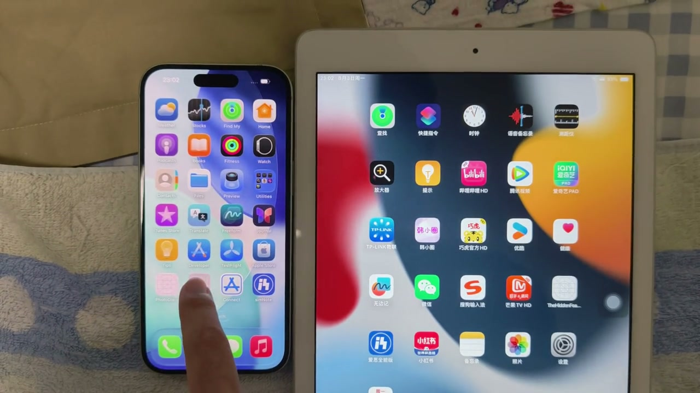

# The Hidden Feature

The Hidden Feature is an experimental two-device iOS app with two nearby-device experiences: a simulated cross-screen Home Screen icon handoff and a direct text chat between an iPhone and an iPad.

The app connects nearby devices with Multipeer Connectivity. Users choose the same experience on both devices, assign left/right roles, and then enter either the simulated Home Screen or a lightweight one-to-one conversation.

> [!NOTE]
> This project does not access or modify the real iOS or iPadOS Home Screen. All icons, layouts, gestures, and transfers are simulated inside the app.

## Demo

https://github.com/user-attachments/assets/4037bbb5-e496-4062-916b-c4159122fcbd

Click the preview to play the 32-second demonstration.

## Features

- Nearby pairing between an iPhone and an iPad
- Left-device and right-device roles with a shared screen edge
- iOS-style Home Screen layouts tailored for iPhone and iPad
- Long-press edit mode with icon jiggle animations
- Local icon dragging and layout reordering
- Cross-device icon preview, takeover, placement, and rollback
- Reliable transfer state synchronization over Multipeer Connectivity
- A separate two-device chat entry with fixed left/right accounts
- Reliable text delivery, acknowledgements, and duplicate suppression
- iPhone and iPad chat layouts modeled after a familiar Chinese messaging interface

## Requirements

- Xcode 26.2 or later
- iOS 17.0 or later
- iPadOS 17.0 or later
- Two physical devices on the same local network or within peer-to-peer wireless range
- An Apple Development signing team

## Running the Demo

1. Open `TheHiddenFeature.xcodeproj` in Xcode.
2. Select your development team for the app target.
3. Build and run the app on both devices.
4. Choose the same experience on both devices.
5. Choose the left-device role on the iPhone and the right-device role on the iPad.
6. Complete nearby pairing.
7. For the desktop demo, place the devices side by side, enter edit mode, and drag an icon across the shared edge.
8. For the chat demo, tap the message field and use the keyboard's Send key to exchange text.

## How It Works

The two displays do not share one continuous system touch sequence. When the drag leaves the source screen, the source device sends the icon and transfer state to the target. The target presents an edge preview and attaches it to a new touch when the user's finger enters the second screen. A request/commit/acknowledgement protocol ensures that only one device owns the icon after the transfer completes.

See [PROJECT_PLAN.md](PROJECT_PLAN.md) for the product design, protocol, and implementation details.

See [CHAT_FEATURE_DESIGN.md](CHAT_FEATURE_DESIGN.md) for the chat experience design and protocol.

## Technology

- SwiftUI
- Multipeer Connectivity
- Swift Observation and structured concurrency
- No third-party runtime dependencies

## Disclaimer

This project is an independent experimental demonstration. It is not affiliated with or endorsed by Apple Inc. Apple product names and visual assets belong to their respective owners.
